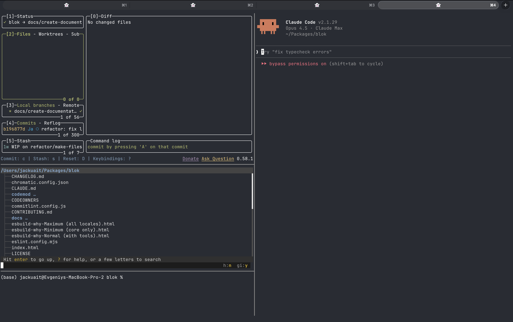

# Ghost Tab

A **`Ghostty`** + **`tmux`** wrapper that launches a four-pane dev session with **`Claude Code`**, **`lazygit`**, **`broot`**, and a spare terminal. Automatically cleans up all processes when the window is closed — no zombie **`Claude Code`** processes.



---

## Quick Start

> [!NOTE]
> **One command to install everything:**

```sh
curl -fsSL https://raw.githubusercontent.com/JackUait/vibecode-editor/main/setup.sh | bash
```

That's it. The script installs all dependencies, sets up **`Ghostty`**, and walks you through adding your projects. Then open a new **`Ghostty`** window.

> [!IMPORTANT]
> **Only requirement:** **`macOS`** with [**`Ghostty`**](https://ghostty.org) installed. Everything else (**`Homebrew`**, **`tmux`**, **`lazygit`**, **`broot`**, **`Claude Code`**) is installed automatically.

---

## Usage

**Step 1.** Open a new **`Ghostty`** window (`Cmd+N`)

**Step 2.** Pick a project from the list:

```
Select project:
  1) my-app
  2) another-project
  0) current directory
>
```

**Step 3.** The four-pane **`tmux`** session launches automatically with **`Claude Code`** already focused — start typing your prompt right away.

> [!TIP]
> You can also open a specific project directly from the terminal:
> ```sh
> ~/.config/ghostty/claude-wrapper.sh /path/to/project
> ```

---

## Hotkeys

| Shortcut | Action |
|---|---|
| `Cmd+T` | New tab |
| `Cmd+Shift+Left` | Previous tab |
| `Cmd+Shift+Right` | Next tab |
| `Left Option` | Acts as `Alt` instead of typing special characters |

---

## What the Setup Script Does

1. Installs **`Homebrew`** (if needed)
2. Installs **`tmux`**, **`lazygit`**, **`broot`**, and **`Claude Code`** via **`Homebrew`**
3. Sets up the **`Ghostty`** config (with merge/replace option if you have an existing one)
4. Walks you through adding your **project directories**

<details>
<summary><strong>Alternative: Clone and Run</strong></summary>

```sh
git clone https://github.com/JackUait/vibecode-editor.git
cd vibecode-editor
./setup.sh
```

</details>

<details>
<summary><strong>Alternative: Manual Setup</strong></summary>

If you prefer to set things up by hand:

1. Copy `ghostty/claude-wrapper.sh` to `~/.config/ghostty/` and make it executable
2. Add `command = ~/.config/ghostty/claude-wrapper.sh` to `~/.config/ghostty/config`
3. Add your projects to `~/.config/vibecode-editor/projects`, one per line in `name:path` format:

```
my-app:/path/to/my-app
another-project:/path/to/another-project
```

Lines starting with `#` are ignored. If the file doesn't exist or is empty, the wrapper opens in the current directory.

</details>

---

## Process Cleanup

> [!CAUTION]
> When you close the **`Ghostty`** window, **all processes are force-terminated** — make sure your work is saved.

The wrapper automatically:

1. **Recursively kills** the full process tree of every **`tmux`** pane (including deeply nested subprocesses spawned by **`Claude Code`**, **`lazygit`**, etc.)
2. **Force-kills** (`SIGKILL`) any processes that ignored the initial `SIGTERM` after a brief grace period
3. **Destroys** the **`tmux`** session
4. **Self-destructs** the session via `destroy-unattached` if the **`tmux`** client disconnects without triggering cleanup

This prevents zombie **`Claude Code`** processes from accumulating.
